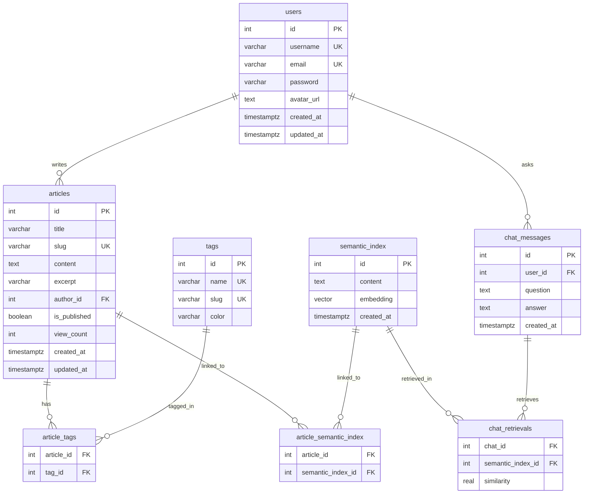

# 🧠 Synapse — Product Requirements Document (PRD)

**Version:** 1.0
**Author:** —
**Date:** 2026-06-19
**Status:** Draft

---

## 1. Product Overview

**Synapse** adalah knowledge base platform berbasis web yang menggabungkan manajemen artikel dengan kemampuan **RAG (Retrieval-Augmented Generation)**. Sistem ini memungkinkan tim untuk menyimpan, mengorganisir, dan mencari pengetahuan — lalu bertanya dalam bahasa natural dan mendapatkan jawaban yang akurat berdasarkan konten yang tersimpan.

### Tagline

> *Connect your knowledge. Ask naturally. Get answers.*

---

## 2. Problem Statement

| Masalah | Dampak |
|---|---|
| Pengetahuan tersebar di berbagai dokumen, chat, dan email | Informasi sulit ditemukan, duplikasi kerja |
| Keyword search sering tidak menemukan hasil yang relevan | User frustasi, beralih ke bertanya langsung ke orang |
| Tidak ada cara bertanya dalam bahasa natural ke knowledge base | Akses pengetahuan lambat, bottleneck di subject matter expert |
| Hasil pencarian tidak bisa di-improve secara iteratif | Kualitas search stagnan, tidak belajar dari feedback |

---

## 3. Target Users

| Persona | Deskripsi | Kebutuhan Utama |
|---|---|---|
| **Writer** | Tim member yang menulis dan mengelola artikel | CRUD artikel, markdown editor, tagging |
| **Reader** | Tim member yang mencari informasi | Search (keyword & semantic), baca artikel |
| **Asker** | Tim member yang bertanya via chat | RAG chat, jawaban + referensi artikel |
| **Admin** | Pengelola knowledge base | Review chat history, promote pertanyaan, kelola semantic index |

---

## 4. Goals & Success Metrics

### Goals
1. Menyediakan **single source of truth** untuk pengetahuan tim
2. Memungkinkan pencarian berdasarkan **makna**, bukan hanya keyword
3. Menjawab pertanyaan secara natural via **RAG** dengan referensi yang jelas
4. Membangun **learning loop** — semakin digunakan, semakin akurat

### Success Metrics

| Metric | Target | Cara Ukur |
|---|---|---|
| Search relevance | >80% user menemukan yang dicari di top 5 hasil | User feedback / click-through rate |
| RAG accuracy | >70% jawaban dinilai akurat oleh admin | Review & promote rate |
| Knowledge coverage | Terus bertambah melalui artikel + promote | Jumlah entries di `semantic_index` |
| Adoption | >60% tim aktif menggunakan dalam 3 bulan | Monthly active users |

---

## 5. User Stories

### Article Management
- **US-01**: Sebagai Writer, saya ingin **membuat artikel dalam format Markdown** agar konten bisa terstruktur dengan baik.
- **US-02**: Sebagai Writer, saya ingin **memberikan tag pada artikel** agar mudah dikategorikan.
- **US-03**: Sebagai Writer, saya ingin **menyimpan artikel sebagai draft** sebelum dipublish.
- **US-04**: Sebagai Reader, saya ingin **membaca artikel** dengan rendering Markdown yang baik (syntax highlighting, math, diagram).

### Search
- **US-05**: Sebagai Reader, saya ingin **mencari artikel berdasarkan keyword** agar cepat menemukan yang saya cari.
- **US-06**: Sebagai Reader, saya ingin **mencari berdasarkan makna** agar menemukan artikel relevan meskipun kata kunci berbeda.
- **US-07**: Sebagai Reader, saya ingin **memfilter hasil pencarian** berdasarkan tag, tanggal, atau author.

### RAG Chat
- **US-08**: Sebagai Asker, saya ingin **bertanya dalam bahasa natural** dan mendapat jawaban berdasarkan knowledge base.
- **US-09**: Sebagai Asker, saya ingin **melihat sumber referensi** (artikel terkait) dari jawaban RAG.
- **US-10**: Sebagai Asker, saya ingin **jawaban ditampilkan secara streaming** agar tidak perlu menunggu lama.

### Feedback Loop
- **US-11**: Sebagai Admin, saya ingin **mereview history chat** dan melihat knowledge entries mana yang di-retrieve beserta similarity score-nya.
- **US-12**: Sebagai Admin, jika retrieval tidak tepat, saya ingin **promote pertanyaan user ke semantic index** dan memilihkan artikel yang sesuai.

### Semantic Index
- **US-13**: Sebagai Admin, saya ingin **menambahkan entry ke semantic index secara manual** untuk memperkaya basis pencarian.
- **US-14**: Sebagai Writer, saat membuat artikel, saya ingin **judul otomatis di-embed dan masuk ke semantic index** dan terlink ke artikel.

### Authentication
- **US-15**: Sebagai User, saya ingin **register dan login** untuk mengakses fitur yang memerlukan autentikasi.

---

## 6. Functional Requirements

### FR-01: Article Management
| ID | Requirement | Priority |
|---|---|---|
| FR-01.1 | CRUD artikel (create, read, update, delete) | Must |
| FR-01.2 | Konten artikel dalam format Markdown | Must |
| FR-01.3 | Auto-generate slug dari judul | Must |
| FR-01.4 | Auto-generate excerpt dari konten | Should |
| FR-01.5 | Draft / publish system (`is_published`) | Must |
| FR-01.6 | View count tracking | Could |
| FR-01.7 | Saat artikel dibuat, embed judul → `semantic_index` dan link via `article_semantic_index` | Must |
| FR-01.8 | Saat judul artikel diupdate, re-embed entry terkait | Must |

### FR-02: Tag Management
| ID | Requirement | Priority |
|---|---|---|
| FR-02.1 | CRUD tags | Must |
| FR-02.2 | Many-to-many relationship artikel ↔ tag | Must |
| FR-02.3 | Custom warna per tag (hex color) | Should |

### FR-03: Semantic Index
| ID | Requirement | Priority |
|---|---|---|
| FR-03.1 | Add entry secara manual (auto-embed via Gemini API) | Must |
| FR-03.2 | List entries dengan pagination | Must |
| FR-03.3 | Delete entry | Must |
| FR-03.4 | Bulk import entries | Could |
| FR-03.5 | Many-to-many relationship `semantic_index` ↔ `articles` | Must |

### FR-04: Dual Search System
| ID | Requirement | Priority |
|---|---|---|
| FR-04.1 | Full-text search di articles (PostgreSQL GIN + `ts_rank`) | Must |
| FR-04.2 | Semantic search di `semantic_index` (pgvector cosine similarity) | Must |
| FR-04.3 | Hybrid search mode (gabungan FTS + semantic) | Must |
| FR-04.4 | Filter hasil search (by tag, date, author) | Should |

### FR-05: RAG Chat
| ID | Requirement | Priority |
|---|---|---|
| FR-05.1 | User kirim pertanyaan → embed → retrieve top-K dari `semantic_index` | Must |
| FR-05.2 | Fetch artikel terkait via `article_semantic_index` | Must |
| FR-05.3 | Build context prompt (semantic entries + artikel) → generate jawaban via Gemini | Must |
| FR-05.4 | Streaming response (Server-Sent Events) | Must |
| FR-05.5 | Sertakan citation / referensi ke artikel sumber | Must |
| FR-05.6 | Log setiap interaksi ke `chat_messages` + `chat_retrievals` (dengan similarity score) | Must |

### FR-06: RAG Feedback Loop
| ID | Requirement | Priority |
|---|---|---|
| FR-06.1 | List chat history (paginated) | Must |
| FR-06.2 | View detail chat: pertanyaan, jawaban, entries yang di-retrieve + similarity score | Must |
| FR-06.3 | Promote pertanyaan → embed → insert ke `semantic_index` + link ke artikel yang dipilih | Must |

### FR-07: Authentication
| ID | Requirement | Priority |
|---|---|---|
| FR-07.1 | Register (username, email, password) | Must |
| FR-07.2 | Login → JWT token | Must |
| FR-07.3 | Protected routes (JWT middleware) | Must |
| FR-07.4 | Get current user profile | Must |

---

## 7. Non-Functional Requirements

| ID | Requirement | Target |
|---|---|---|
| NFR-01 | **Performance** — Search response time | < 500ms (FTS), < 1s (semantic) |
| NFR-02 | **Performance** — RAG first token latency | < 2s |
| NFR-03 | **Scalability** — Jumlah artikel yang didukung | > 10,000 |
| NFR-04 | **Scalability** — Jumlah semantic index entries | > 100,000 |
| NFR-05 | **Availability** — Uptime | > 99% |
| NFR-06 | **Security** — Password storage | Bcrypt hashed |
| NFR-07 | **Security** — API authentication | JWT with expiry |
| NFR-08 | **UX** — Responsive design | Desktop + tablet + mobile |
| NFR-09 | **UX** — Dark mode | Default theme |
| NFR-10 | **Deployability** — Containerized | Docker Compose |

---

## 8. Data Model



---

## 9. User Flows

### 9.1 Menulis Artikel
```
Writer login → Klik "New Article"
    → Isi judul, konten (Markdown), pilih tags
    → Klik "Save as Draft" atau "Publish"
    → Backend:
        1. Insert artikel
        2. Embed judul via Gemini API
        3. Insert ke semantic_index
        4. Link via article_semantic_index
```

### 9.2 Mencari Informasi
```
Reader ketik query di search bar
    → Pilih mode: FTS / Semantic / Hybrid
    → Lihat hasil dengan ranking
    → Klik artikel untuk baca detail
```

### 9.3 Bertanya via RAG
```
Asker ketik pertanyaan di chat
    → Jawaban muncul secara streaming
    → Lihat referensi artikel di bawah jawaban
    → Klik referensi untuk baca artikel lengkap
```

### 9.4 Review & Promote (Feedback Loop)
```
Admin buka Chat History
    → Lihat daftar pertanyaan + jawaban
    → Klik satu chat → lihat retrieved entries + similarity scores
    → Jika retrieval tidak tepat:
        → Klik "Promote"
        → Pilih artikel-artikel yang relevan
        → Submit → pertanyaan masuk ke semantic_index + linked ke artikel
```

---

## 10. UI Pages

| Page | Path | Deskripsi |
|---|---|---|
| **Home** | `/` | Dashboard: recent articles, stats, quick search |
| **Search** | `/search` | Pencarian dengan toggle mode (FTS/semantic/hybrid) + filters |
| **Chat** | `/chat` | RAG chat interface, streaming jawaban + citations |
| **Article Detail** | `/articles/:slug` | Baca artikel (Markdown rendered) |
| **Article Editor** | `/articles/new`, `/articles/:id/edit` | Markdown editor + live preview |
| **Semantic Index** | `/semantic-index` | List, add, delete semantic index entries |
| **Chat History** | `/chat/history` | Review chat history + promote flow |
| **Login** | `/login` | Login / register |

---

## 11. API Contract Summary

| Domain | Endpoints | Auth Required |
|---|---|---|
| **Auth** | `POST /register`, `POST /login`, `GET /me` | Partial (register/login = no) |
| **Articles** | `GET /list`, `GET /:slug`, `POST`, `PUT`, `DELETE` | Write ops = yes |
| **Tags** | `GET /list`, `POST`, `PUT`, `DELETE` | Write ops = yes |
| **Semantic Index** | `GET /list`, `POST`, `DELETE` | Yes |
| **Search** | `GET /?q=...&mode=...` | No |
| **Chat** | `POST /`, `GET /history`, `GET /:id`, `POST /:id/promote` | Yes |

---

## 12. Constraints & Assumptions

### Constraints
- Embedding model fixed: Gemini `text-embedding-004` (768 dimensions)
- LLM model: Gemini `gemini-2.5-flash`
- Database: harus PostgreSQL dengan pgvector extension
- Runtime: Bun (bukan Node.js)

### Assumptions
- User memiliki akses ke Google Gemini API (API key)
- PostgreSQL sudah terinstall dengan pgvector extension
- Volume artikel dalam skala ribuan (bukan jutaan)
- Single-tenant deployment (satu instance per tim)

### Dependencies
- Google Gemini API (embedding + generative)
- PostgreSQL + pgvector
- Bun runtime

---

## 13. Rollout Plan

| Phase | Scope | Deliverables |
|---|---|---|
| **Phase 1 — Foundation** | Infrastruktur | Project setup, DB migrations, server + client bootstrap |
| **Phase 2 — Core CRUD** | Fungsionalitas dasar | Auth, article CRUD, tag management, basic UI |
| **Phase 3 — Search & Intelligence** | Pencarian | Embedding integration, semantic index CRUD, FTS + semantic + hybrid search |
| **Phase 4 — RAG** | AI chat | RAG pipeline, streaming, citations, chat logging, promote/feedback loop |
| **Phase 5 — UI Polish** | User experience | Premium design, markdown editor/renderer, animations, responsive |
| **Phase 6 — Production** | Go live | Validation, rate limiting, optimization, Docker Compose |

---

> [!NOTE]
> Dokumen ini adalah **living document** yang akan di-update seiring perkembangan project. Untuk konvensi teknis dan coding, lihat [AGENTS.md](.agents/AGENTS.md).
